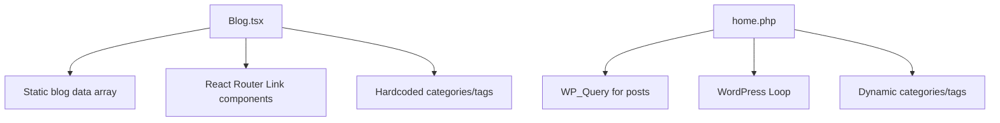
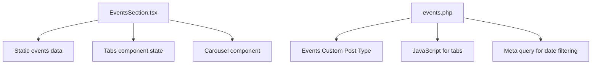
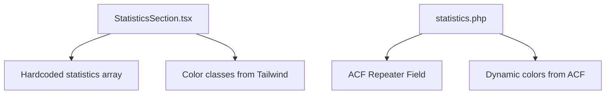

# WordPress Data Flow & Component Dependencies

## Data Flow Architecture

### React → WordPress Data Mapping

#### Static Content Flow
```
React Props/Hardcoded → WordPress Customizer/Theme Options → PHP Template
```

**Example:**
```javascript
// React (HeroSection.tsx)
<h1>Where Dreams Take Flight</h1>

// WordPress (template-parts/hero-section.php)  
<h1><?php echo get_theme_mod('hero_title_line_1', 'Where Dreams'); ?></h1>
```

#### Dynamic Content Flow
```  
React State/Props → WordPress Custom Post Types → WP_Query → Template Loop
```

**Example:**
```javascript
// React (EventsSection.tsx)
const [events, setEvents] = useState(eventsData);

// WordPress (template-parts/events.php)
<?php 
$events = new WP_Query([
    'post_type' => 'events',
    'posts_per_page' => -1
]);
while($events->have_posts()) : $events->the_post();
?>
```

#### Form Handling Flow
```
React onSubmit + WhatsApp → WordPress Contact Form 7 + WhatsApp
```

## Component Dependencies Map

### Navigation Component Dependencies
```mermaid
graph TD
    A[Navigation.tsx] --> B[React Router useNavigate]
    A --> C[Scroll function prop]
    A --> D[Mobile menu state]
    
    E[header.php] --> F[wp_nav_menu()]
    E --> G[get_theme_mod() for logo]
    E --> H[JavaScript for mobile menu]
```

**React Dependencies:**
- `react-router-dom` → WordPress navigation and internal linking
- `useState` for mobile menu → Vanilla JavaScript toggle
- `scrollToSection` prop → JavaScript smooth scroll function

**WordPress Implementation:**
```php
// header.php
wp_nav_menu([
    'theme_location' => 'primary',
    'menu_class' => 'hidden md:flex space-x-8',
    'walker' => new Custom_Nav_Walker()
]);
```

### Hero Section Dependencies
```mermaid
graph TD
    A[HeroSection.tsx] --> B[useState for image carousel]
    A --> C[useEffect for auto-advance]
    A --> D[Static hero content]
    
    E[hero-section.php] --> F[ACF get_field() for content]
    E --> G[JavaScript carousel logic]
    E --> H[Hero images from ACF gallery]
```

**React Dependencies:**
- `useState(currentImageIndex)` → JavaScript variable
- `useEffect` with setInterval → `setInterval` in vanilla JS
- Hardcoded images array → ACF gallery field

**WordPress Implementation:**
```php
// ACF Fields
$hero_images = get_field('hero_images');
foreach($hero_images as $image) {
    echo '<div class="hero-image">';
    echo wp_get_attachment_image($image['ID'], 'large');
    echo '</div>';
}
```

### Blog Section Dependencies


**React Dependencies:**  
- Static `blogPosts` array → WordPress posts from database
- `Link` components → `get_permalink()` functions
- Hardcoded sidebar data → Dynamic WordPress widgets

**WordPress Implementation:**
```php
// home.php - Blog listing
while(have_posts()) : the_post();
    get_template_part('template-parts/content');
endwhile;

// Dynamic categories
$categories = get_categories();
foreach($categories as $category) {
    echo '<a href="' . get_category_link($category->term_id) . '">';
    echo $category->name . ' (' . $category->count . ')';
    echo '</a>';
}
```

### Events Section Dependencies


**React Dependencies:**
- Hardcoded events data → Events CPT posts
- `Tabs` component state → JavaScript tab switching
- `Carousel` component → Vanilla JS or Swiper.js

**WordPress Implementation:**
```php
// Upcoming Events Query
$upcoming_events = new WP_Query([
    'post_type' => 'events',
    'meta_key' => 'event_date',
    'meta_value' => date('Y-m-d'),
    'meta_compare' => '>=',
    'orderby' => 'meta_value',
    'order' => 'ASC'
]);

// Past Events Query  
$past_events = new WP_Query([
    'post_type' => 'events',
    'meta_key' => 'event_date', 
    'meta_value' => date('Y-m-d'),
    'meta_compare' => '<',
    'orderby' => 'meta_value',
    'order' => 'DESC'
]);
```

### Statistics Section Dependencies


**React Dependencies:**
- Static statistics data → ACF repeater field
- Tailwind color classes → ACF color picker values

**WordPress Implementation:**
```php
// ACF Repeater for Statistics
if(have_rows('statistics')) :
    while(have_rows('statistics')) : the_row();
        $number = get_sub_field('stat_number');
        $label = get_sub_field('stat_label');  
        $color = get_sub_field('stat_color');
        $bg_color = get_sub_field('stat_bg_color');
        
        echo '<div class="statistic-card" style="background-color: ' . $bg_color . '">';
        echo '<div style="color: ' . $color . '">' . $number . '</div>';
        echo '<div>' . $label . '</div>';  
        echo '</div>';
    endwhile;
endif;
```

## Interactive Elements Conversion

### WhatsApp Integration
**React Implementation:**
```javascript
// WhatsAppChat.tsx
const handleSendMessage = () => {
  const encodedMessage = encodeURIComponent(message);
  const whatsappUrl = `https://wa.me/6598372670?text=${encodedMessage}`;
  window.open(whatsappUrl, '_blank');
};
```

**WordPress Implementation:**
```javascript
// assets/js/whatsapp.js
function openWhatsApp(message) {
    const phoneNumber = '<?php echo get_theme_mod("whatsapp_number", "6598372670"); ?>';
    const encodedMessage = encodeURIComponent(message);
    const whatsappUrl = `https://wa.me/${phoneNumber}?text=${encodedMessage}`;
    window.open(whatsappUrl, '_blank');
}
```

### Form Handling
**React Implementation:**
```javascript
// TrialsSection.tsx  
const handleSubmit = (e) => {
  e.preventDefault();
  const whatsappMessage = `*Trial Class Booking Request*
  
  *Name:* ${formData.name}
  *Email:* ${formData.email}
  // ...rest of message
  `;
  openWhatsApp(whatsappMessage);
};
```

**WordPress Implementation (Contact Form 7):**
```php
// Contact Form 7 form
[text* your-name placeholder "Full Name"]
[email* your-email placeholder "Email Address"]  
[select dance-style "Ballet" "Hip Hop" "Contemporary"]
[submit "Book Trial Class"]

// Form submission hook
add_action('wpcf7_mail_sent', function($contact_form) {
    $submission = WPCF7_Submission::get_instance();
    $posted_data = $submission->get_posted_data();
    
    // Format WhatsApp message
    $message = "*Trial Class Booking Request*\n\n";
    $message .= "*Name:* " . $posted_data['your-name'] . "\n";
    $message .= "*Email:* " . $posted_data['your-email'] . "\n";
    // ... rest of formatting
});
```

## State Management Conversion

### React State → WordPress Options/Meta

| React State | WordPress Storage | Access Method |
|---|---|---|
| `useState(heroIndex)` | JavaScript variable | `let currentSlide = 0;` |
| `useState(mobileMenuOpen)` | CSS class toggle | `element.classList.toggle('open')` |
| `useState(modalOpen)` | CSS class toggle | `modal.classList.add('active')` |
| Navigation active state | Current page check | `is_page()` or `is_single()` |
| Form data state | Contact Form 7 | `$_POST` data in form handler |

### Event Handling Conversion

| React Event | WordPress/JS Equivalent |
|---|---|
| `onClick={handleClick}` | `addEventListener('click', handleClick)` |
| `onSubmit={handleSubmit}` | Contact Form 7 hooks or form event listener |
| `useEffect` cleanup | `removeEventListener` in appropriate scope |
| Router navigation | `window.location.href` or History API |

## Performance Considerations

### Asset Loading Strategy
```php
// functions.php - Conditional loading
function enqueue_page_specific_assets() {
    if(is_front_page()) {
        wp_enqueue_script('hero-carousel', get_template_directory_uri() . '/assets/js/carousel.js');
    }
    
    if(is_home() || is_single()) {
        wp_enqueue_script('blog-interactions', get_template_directory_uri() . '/assets/js/blog.js');
    }
}
add_action('wp_enqueue_scripts', 'enqueue_page_specific_assets');
```

### Database Query Optimization
```php
// Efficient queries for large datasets
$events = new WP_Query([
    'post_type' => 'events',
    'posts_per_page' => 6, // Limit results
    'fields' => 'ids',      // Only get IDs initially
    'no_found_rows' => true, // Skip pagination count
    'update_post_meta_cache' => false, // Skip meta cache if not needed
]);
```

### Caching Strategy
```php
// Cache expensive queries
$cache_key = 'homepage_events_' . get_current_blog_id();
$events = wp_cache_get($cache_key);

if(false === $events) {
    $events = new WP_Query($args);
    wp_cache_set($cache_key, $events, '', 3600); // 1 hour cache
}
```

This data flow documentation ensures that all React functionality is properly converted to WordPress while maintaining the same user experience and performance characteristics.